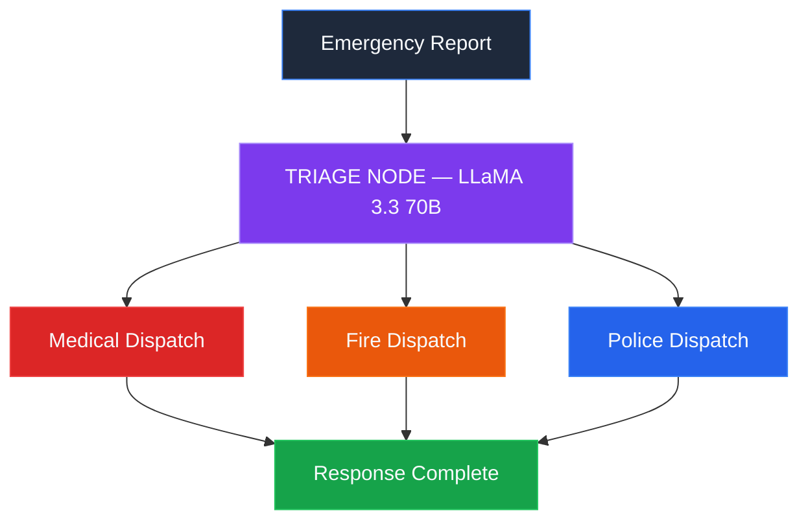

<div align="center">

# CRISIS DISPATCH

### AI-Powered Emergency Response Coordination

**Triage. Dispatch. Save Lives — in under 3 seconds.**

<br/>

[](https://langchain-ai.github.io/langgraph/)
[](https://groq.com)
[](https://fastapi.tiangolo.com)
[](https://leafletjs.com)

<br/>

[Problem](#the-problem) · [Architecture](#architecture) · [Features](#features) · [Tech Stack](#tech-stack) · [Quick Start](#quick-start) · [API](#api-reference) · [Team](#team)

<br/>

---

</div>

<br/>

## The Problem

> Traditional emergency dispatch relies on human operators manually triaging calls, searching for the nearest hospital, and coordinating across police, fire, and medical agencies — a process that averages **5 to 15 minutes** per incident.
>
> During mass casualty events, every second of that delay can cost a life.

**Crisis Dispatch** eliminates that bottleneck with a fully autonomous AI pipeline:

| Step | What Happens | Time |
|:-----|:-------------|:-----|
| **1. Report** | Civilian submits a voice or text emergency report with GPS coordinates | Instant |
| **2. AI Triage** | LLM classifies severity, category, victim count, and required resources | ~300ms |
| **3. Parallel Dispatch** | Three agency-specific dispatch nodes execute simultaneously via LangGraph | ~2s |
| **4. Live Dashboard** | Assigned stations receive live incident cards with map routing and ETA | Real-time |

**Total elapsed time from report to dispatch: approximately 2.5 seconds.**

<br/>

---

<br/>

## Architecture

### LangGraph Agentic Workflow

This system is not a simple API wrapper around an LLM. It is a **stateful, multi-agent graph** built with LangGraph's `StateGraph`, where each node is an autonomous reasoning unit:



| Node | Responsibility | Intelligence Layer |
|:-----|:---------------|:-------------------|
| **Triage** | Classifies emergency type, severity, victim count, and resource requirements | LLaMA 3.3 70B via Groq — structured Pydantic output |
| **Medical Dispatch** | Locates optimal hospital based on proximity and capability match | Vectorized Haversine + LLM matchmaking |
| **Fire Dispatch** | Identifies nearest fire station with appropriate equipment | Vectorized Haversine + LLM matchmaking |
| **Police Dispatch** | Deploys security response if crisis category warrants it | Conditionally skipped when not required |

> **Key design decision:** The fan-out / fan-in topology means all three dispatch nodes execute **in parallel** after triage — reducing total latency from ~9 seconds (sequential) to ~3 seconds.

<br/>

### End-to-End System Overview

```
 FRONTEND                          BACKEND                              DATA
┌──────────────────┐   ┌───────────────────────────────────┐   ┌──────────────────────┐
│                  │   │                                   │   │                      │
│  Dispatch Portal │──▶│  FastAPI  ─▶  LangGraph Engine    │──▶│  26,000+ Hospitals   │
│  (Report + Map)  │   │                                   │   │  15,000+ Police Stn  │
│                  │   │  ┌─────────┐  ┌───────────────┐   │   │  400+ Fire Stations  │
│  Responder Login │──▶│  │ Triage  │──│ Parallel      │   │   │                      │
│                  │   │  │ (Groq)  │  │ Dispatch x3   │   │   │  SQLite Incident DB  │
│  Command Dash    │◀──│  └─────────┘  └───────┬───────┘   │   │                      │
│  (Live Feed)     │   │                       │           │   │  Uploaded Evidence    │
│                  │   │               ┌───────▼───────┐   │   │                      │
│  Global Heatmap  │◀──│               │ SQLite + JSON │   │   └──────────────────────┘
│                  │   │               └───────────────┘   │
└──────────────────┘   └───────────────────────────────────┘
```

<br/>

---

<br/>

## Features

### Dispatch Engine

| Capability | Description |
|:-----------|:------------|
| **Structured AI Triage** | LLM extracts `{category, severity, victims, resource_vector, tts_summary}` with Pydantic-enforced schema |
| **Multi-Agency Parallel Dispatch** | LangGraph simultaneously dispatches medical, fire, and police units |
| **Geospatial Matchmaking** | Vectorized Haversine across 40K+ stations, narrowed to 5 candidates, then LLM selects the best-fit |
| **Distance-Based ETA** | Real-time arrival estimates calculated from Haversine distance |
| **Conditional Routing** | Police/fire nodes are intelligently skipped when the crisis category doesn't require them |

### User Interfaces

| Page | Route | Purpose |
|:-----|:------|:--------|
| **Dispatch Portal** | `/` | Three-column layout — GPS input, incident report (voice + text), live map with unit routing |
| **Responder Login** | `/login` | Authenticated access for agencies — validates against real station datasets |
| **Command Dashboard** | `/dashboard` | Live incident feed, interactive map, severity statistics, incident resolution, PDF export |
| **Global Heatmap** | `/heatmap` | Severity-weighted heat visualization of all historical incidents on a dark-themed map |

### Additional Capabilities

- **Speech-to-Text Input** — Browser-native Web Speech API for hands-free emergency reporting
- **Evidence Upload** — Attach images or documents to incident reports
- **PDF Report Generation** — One-click downloadable incident reports via jsPDF
- **Interactive Mapping** — Custom Leaflet.js markers, dashed route lines, and informational popups
- **Auto-Refresh Polling** — Dashboard updates every 5 seconds without manual intervention
- **Incident Resolution** — Responders can mark incidents as resolved from their dashboard
- **Emergency Helplines** — Quick-access panel for national helpline numbers (100, 101, 102, 108)
- **Responsive Design** — Functional across desktop, tablet, and mobile viewports

<br/>

---

<br/>

## Tech Stack

| Layer | Technology | Rationale |
|:------|:-----------|:----------|
| **LLM Inference** | Groq — LLaMA 3.3 70B Versatile | Fastest available inference (~300ms) for real-time triage |
| **Agent Orchestration** | LangGraph `StateGraph` | Enables stateful, parallel multi-agent workflows with fan-out/fan-in |
| **Structured Output** | LangChain + Pydantic | Type-safe LLM responses — no fragile regex parsing |
| **Backend** | FastAPI | Async-native, auto-generated OpenAPI docs, ideal for AI service layers |
| **Database** | SQLite | Zero-configuration persistent storage for incident records |
| **Geospatial** | NumPy + Pandas (Haversine) | Vectorized distance computation across 40,000+ stations in milliseconds |
| **Mapping** | Leaflet.js + CartoDB Tiles | Open-source, lightweight, supports custom markers and heatmaps |
| **Heatmap** | Leaflet.heat | Severity-weighted gradient visualization |
| **Voice Input** | Web Speech API | Zero-dependency, browser-native speech recognition |
| **Reports** | jsPDF | Client-side PDF generation without server overhead |

### Datasets

| Dataset | Records | Source |
|:--------|:--------|:-------|
| India Hospital Directory | ~26,000 hospitals | Government open data (cleaned) |
| India Police Stations | ~15,000 stations | Government open data |
| India Fire Stations | ~400 stations | OpenStreetMap extract |

<br/>

---

<br/>

## Quick Start

### Prerequisites

| Requirement | Details |
|:------------|:--------|
| **Python** | Version 3.10 or higher |
| **pip** | Comes bundled with Python |
| **Groq API Key** | Free tier available at [console.groq.com](https://console.groq.com) |
| **Git** | For cloning the repository |

### 1 — Clone the Repository

```bash
git clone https://github.com/taher51-lang/crisis-dispatch.git
cd crisis-dispatch
```

### 2 — Create a Virtual Environment

```bash
# Create virtual environment
python -m venv venv

# Activate it
# macOS / Linux:
source venv/bin/activate

# Windows:
venv\Scripts\activate
```

### 3 — Install Dependencies

```bash
pip install -r requirements.txt
```

This installs the following key packages:

| Package | Purpose |
|:--------|:--------|
| `fastapi` + `uvicorn` | Async web framework and ASGI server |
| `langchain-core` | LangChain foundation for prompt engineering |
| `langchain-groq` | Groq LLM provider integration |
| `langgraph` | Multi-agent stateful workflow orchestration |
| `pandas` + `numpy` | Geospatial data processing and Haversine math |
| `langchain-google-genai` | Google Gemini integration (optional) |
| `langchain-xai` | xAI Grok integration (optional) |
| `faiss-cpu` | Vector similarity search |
| `python-multipart` | File upload support for FastAPI |
| `python-dotenv` | Environment variable management |

### 4 — Configure Environment Variables

Create a `.env` file in the project root:

```bash
# Required
GROQ_API_KEY=your_groq_api_key_here

# Optional (for alternative LLM providers)
GOOGLE_API_KEY=your_google_api_key_here
XAI_API_KEY=your_xai_api_key_here
```

> You only need `GROQ_API_KEY` to run the system. The other keys are for optional provider support.

### 5 — Launch the Server

```bash
uvicorn app:app --reload --host 0.0.0.0 --port 8000
```

You should see output like:

```
INFO:     Uvicorn running on http://0.0.0.0:8000
INFO:     Application startup complete.
```

### 6 — Access the Application

| URL | Page | Description |
|:----|:-----|:------------|
| `http://localhost:8000` | Dispatch Portal | Submit emergency reports with GPS and voice input |
| `http://localhost:8000/login` | Responder Login | Authenticate as a police, fire, or medical station |
| `http://localhost:8000/dashboard` | Command Dashboard | View live incidents, map routing, and resolve cases |
| `http://localhost:8000/heatmap` | Global Heatmap | Severity-weighted visualization of all historical incidents |

### Troubleshooting

| Issue | Solution |
|:------|:---------|
| `ModuleNotFoundError` | Ensure your virtual environment is activated and run `pip install -r requirements.txt` again |
| `GROQ_API_KEY not found` | Verify the `.env` file exists in the project root with the correct key |
| Port 8000 already in use | Run with a different port: `uvicorn app:app --reload --port 8001` |
| CSV load warnings on startup | The system uses fallback data automatically — this is non-blocking |

<br/>

---

<br/>

## API Reference

### `POST /api/v1/triage`

Primary dispatch endpoint. Accepts an emergency report and returns structured triage analysis with multi-agency dispatch decisions.

**Request**
```json
{
  "latitude": 18.9681,
  "longitude": 72.8072,
  "description": "Massive fire in hotel kitchen, 3 chefs with severe burns",
  "media_url": null
}
```

**Response**
```json
{
  "id": "INC-A3F2B1C8",
  "timestamp": "2026-04-28T06:00:00.000Z",
  "user_location": {
    "latitude": 18.9681,
    "longitude": 72.8072
  },
  "triage_analysis": {
    "crisis_category": "FIRE",
    "severity_level": "CRITICAL",
    "estimated_victims": 3,
    "resource_vector": ["fire_engine", "burn_unit_ambulance", "trauma_surgeon"],
    "tts_summary": "Critical fire at hotel. 3 burn victims. Dispatch fire and medical immediately."
  },
  "dispatched_units": {
    "medical": {
      "hospital_name": "Holy Family Hospital",
      "latitude": 19.0456,
      "longitude": 72.8321,
      "distance_km": 4.12,
      "estimated_eta_minutes": 6,
      "ai_reasoning": "Closest hospital with burn unit and trauma surgery capabilities."
    },
    "fire": {
      "unit_name": "Fire Station Colaba",
      "distance_km": 2.31,
      "estimated_eta_minutes": 3,
      "ai_reasoning": "Nearest fire station with full suppression equipment."
    },
    "police": {
      "status": "Not Required"
    }
  }
}
```

### Supporting Endpoints

| Method | Endpoint | Description |
|:-------|:---------|:------------|
| `POST` | `/api/v1/login` | Authenticate responders against station datasets |
| `GET` | `/api/v1/incidents/{station}` | Retrieve incidents assigned to a specific station |
| `POST` | `/api/v1/incidents/{id}/resolve` | Mark an incident as resolved |
| `GET` | `/api/v1/all_incidents` | Retrieve all incidents (heatmap data source) |
| `POST` | `/api/v1/upload` | Upload media or evidence files |

<br/>

---

<br/>

## How the AI Pipeline Works

### Step 1 — Structured Triage

The user's raw report is sent to **LLaMA 3.3 70B** via Groq with a system prompt that forces structured JSON output conforming to a Pydantic schema:

```python
class EmergencyPayload(BaseModel):
    crisis_category: Literal["MEDICAL", "FIRE", "SECURITY", "CHEMICAL", "STRUCTURAL", "NATURAL_DISASTER"]
    severity_level: Literal["LOW", "MODERATE", "HIGH", "CRITICAL", "MASS_CASUALTY"]
    estimated_victims: int
    resource_vector: List[str]    # e.g. ["trauma_surgeon", "fire_engine"]
    tts_summary: str              # Concise 2-sentence summary for text-to-speech
```

### Step 2 — Geospatial Filtering

For each agency type (medical, fire, police), the system computes **vectorized Haversine distances** across the full dataset and extracts the **5 closest candidates** in under 10ms.

### Step 3 — AI Matchmaking

Those 5 candidates and the required resource vector are sent to a second LLM invocation that reasons about **capability alignment**:

> *"Holy Family Hospital is the optimal choice because its stated burn unit and trauma surgery capabilities directly match the required resources, and it is the closest facility at 4.12 km."*

### Step 4 — Parallel Execution

LangGraph's `StateGraph` executes all three dispatch nodes **concurrently** after triage completes, cutting total pipeline latency from ~9 seconds (sequential) to ~3 seconds (parallel).

<br/>

---

<br/>

## Project Structure

```
crisis-dispatch/
├── app.py                          # FastAPI backend + LangGraph workflow engine
├── index.html                      # Standalone SOS portal page
├── .env                            # API keys (Groq, Google, etc.)
│
├── templates/
│   ├── index.html                  # Main dispatch portal — 3-column layout
│   ├── login.html                  # Responder authentication page
│   ├── dashboard.html              # Agency command center dashboard
│   └── heatmap.html                # City-wide incident heatmap
│
├── static/
│   ├── app.js                      # Frontend dispatch logic and map rendering
│   └── styles.css                  # Shared design system and components
│
├── data/
│   ├── hospital_directory_cleaned.csv    # ~26,000 hospitals
│   ├── INDIA_POLICE_STATIONS.csv         # ~15,000 police stations
│   └── OpenStreetMap_-_Fire_Station.csv  # ~400 fire stations
│
├── database/
│   └── dispatch_v2.db              # SQLite persistent incident storage
│
├── uploads/                        # Uploaded evidence files
└── tests/
    └── test_csv.py                 # Dataset validation tests
```

<br/>

---

<br/>

## Why This Project Stands Out

| Dimension | What We Built |
|:----------|:-------------|
| **Technical Depth** | LangGraph multi-agent state machine with parallel fan-out/fan-in — not a basic LLM API wrapper |
| **Real-World Data** | 40,000+ actual government-sourced stations — zero mock data |
| **Dual-LLM Pipeline** | Structured triage followed by capability-aware matchmaking — two distinct reasoning steps |
| **Full-Stack Delivery** | Four production-quality UI pages with maps, live feeds, PDF export, and responsive layouts |
| **Sub-3s Latency** | Groq inference + parallel dispatch = response times suitable for genuine emergency use |
| **Social Impact** | Directly applicable to NDMA, municipal fire departments, and hospital networks across India |

<br/>

---

<br/>

## Roadmap

- [ ] WebSocket push notifications to replace polling
- [ ] Progressive Web App (PWA) with offline incident caching
- [ ] Multilingual voice input — Hindi, Gujarati, Tamil, and more
- [ ] AI-powered image analysis for uploaded evidence (damage assessment)
- [ ] Inter-agency resource sharing and coordination protocol
- [ ] Historical analytics dashboard with trend analysis

<br/>

---

<br/>

## Team

Built at **GDG Hackathon 2026**.

<br/>

---

<p align="center">
  <sub>
    <strong>Crisis Dispatch</strong> — Because the difference between life and death is measured in seconds, not minutes.
  </sub>
</p>
